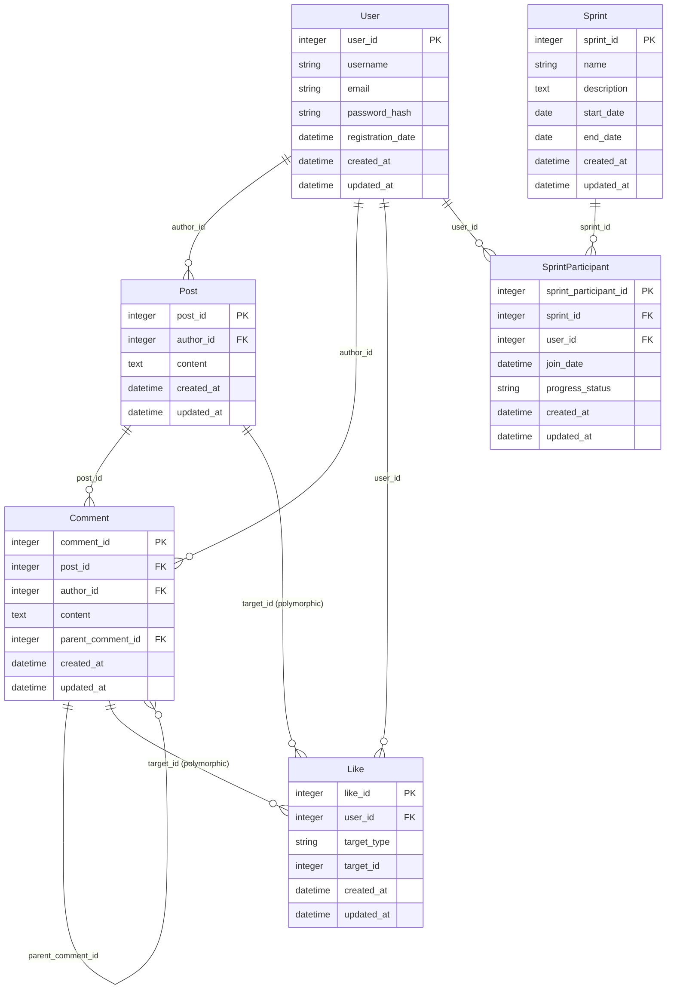

# Схема базы данных Make Meet

## Диаграмма ER (Entity-Relationship)

## Описание моделей

### User (Пользователь)
- **user_id** - уникальный идентификатор пользователя
- **username** - имя пользователя (уникальное)
- **email** - электронная почта (уникальная)
- **password_hash** - хеш пароля
- **registration_date** - дата регистрации

### Post (Пост)
- **post_id** - уникальный идентификатор поста
- **author_id** - ссылка на пользователя-автора
- **content** - содержимое поста
- **created_at/updated_at** - временные метки

### Comment (Комментарий)
- **comment_id** - уникальный идентификатор комментария
- **post_id** - ссылка на пост
- **author_id** - ссылка на пользователя-автора
- **content** - содержимое комментария
- **parent_comment_id** - ссылка на родительский комментарий (для вложенных комментариев)
- **created_at/updated_at** - временные метки

### Like (Лайк)
- **like_id** - уникальный идентификатор лайка
- **user_id** - ссылка на пользователя
- **target_type** - тип объекта (Post или Comment)
- **target_id** - идентификатор объекта
- **created_at** - время создания

### Sprint (Спринт/Челлендж)
- **sprint_id** - уникальный идентификатор спринта
- **name** - название спринта
- **description** - описание спринта
- **start_date** - дата начала
- **end_date** - дата окончания

### SprintParticipant (Участник спринта)
- **sprint_participant_id** - уникальный идентификатор участия
- **sprint_id** - ссылка на спринт
- **user_id** - ссылка на пользователя
- **join_date** - дата присоединения
- **progress_status** - статус прогресса (not_started, in_progress, completed, dropped)

## Основные ассоциации

1. **User** имеет много **Posts** (как автор)
2. **User** имеет много **Comments** (как автор)
3. **User** имеет много **Likes** (как лайкающий)
4. **User** участвует во многих **Sprints** через **SprintParticipant**

5. **Post** принадлежит одному **User** (автор)
6. **Post** имеет много **Comments**
7. **Post** может иметь много **Likes** (полиморфная связь)

8. **Comment** принадлежит одному **Post**
9. **Comment** принадлежит одному **User** (автор)
10. **Comment** может иметь родительский **Comment** (для вложенности)
11. **Comment** может иметь много **Likes** (полиморфная связь)

12. **Sprint** имеет много **SprintParticipants**
13. **SprintParticipant** принадлежит одному **Sprint** и одному **User**

## Особенности реализации

- Все модели имеют уникальные ID поля для лучшей производительности
- Использованы полиморфные связи для лайков (можно лайкать как посты, так и комментарии)
- Поддержка вложенных комментариев через parent_comment_id
- Индексы для оптимизации запросов по датам и связям
- Валидации на уровне модели для обеспечения целостности данных
